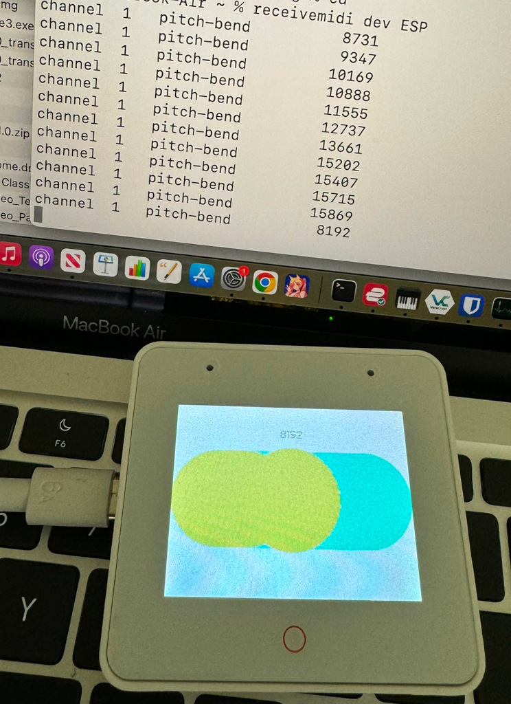
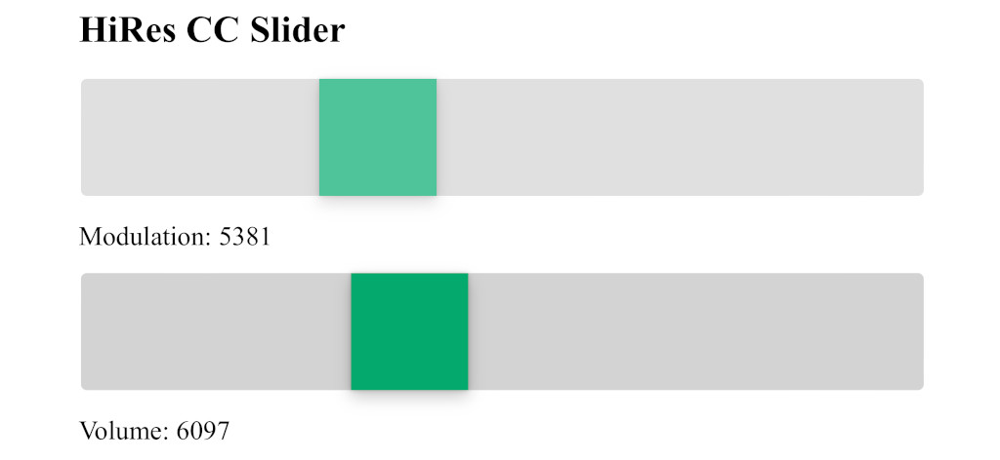
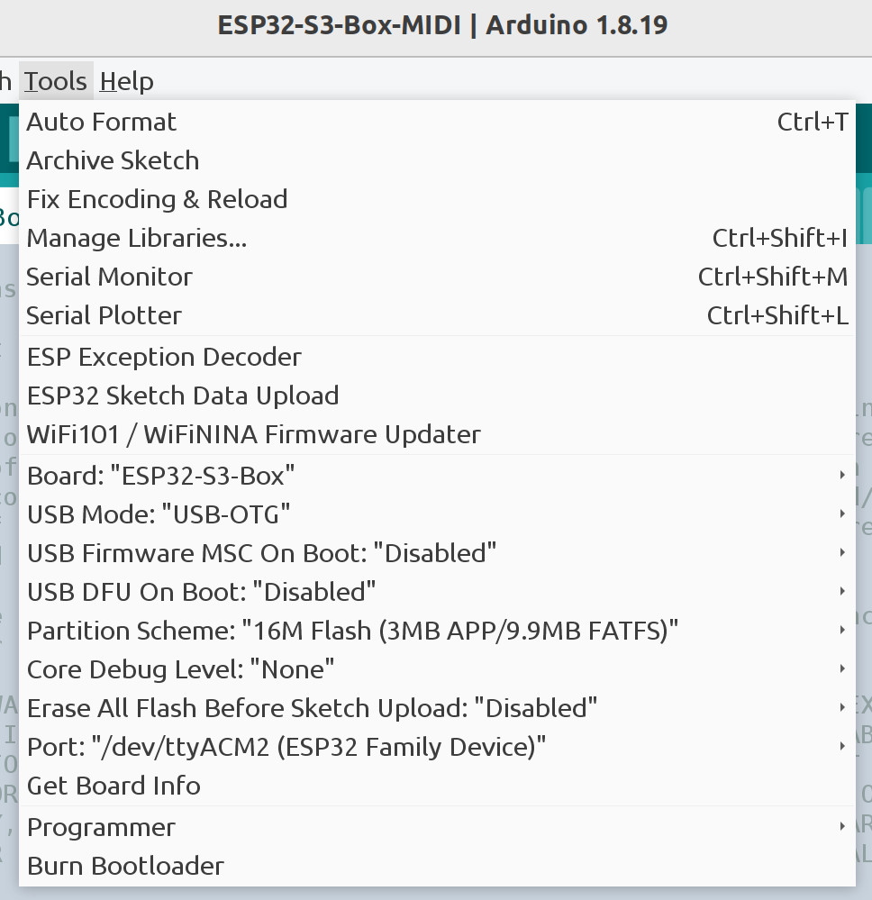

# ESP32-S3 Box MIDI Pitch Bend Slider and Hi-Res MIDI CC HTML Sliders

The photo shows the ESP32-S3-Box with pitch bend slider connected to a MacBook.
The MacBook is running [receivemidi](https://github.com/gbevin/ReceiveMIDI) to
show the MIDI pitch bend messages. The moire pattern and blue splotches are not
visible to the naked eye. They are most likely caused by interference between
the display and the camera.

Tested using Arduino IDE 1.8.19 and
[Espressif ESP32-BOX-S3-3](https://github.com/espressif/esp-box/blob/master/docs/hardware_overview/esp32_s3_box_3/hardware_overview_for_box_3.md)

This project is a demonstration/experiment so do not take it too seriously. It
is based on
[ESP32-S3-Box-MIDI](https://github.com/esp32beans/ESP32-S3-Box-MIDI) and adds a
web page with HMTL5 sliders for 14 bit CC modulation and volume.

This is a simple example of using lvgl to create one slider on the ESP32-S3 Box
display. Moving the slider sends MIDI pitch bend messages over USB. When the
slider is released, the slider springs back to the center position.

In addition, a web server is included which serves up a web page with two HTML5
sliders. The sliders provide control of 14 bit MIDI CC for modulation and
volume. When the web page is displayed on a tablet, the touch resolution
determines the number of unique values. On an iPad, the sliders when moved
slowly provide around 1500 unique values. This is substantially better control
than 7 bit CC controls which provide 128 unique values.

The web page sends the slider position over a web socket back to the ESP32-S3.
The ESP32-S3 converts the slider name and position to 14-bit MIDI CC output
on its USB port.

WiFiManager is used to enter the SSID and pass phrase so the first time the
ESP32 box runs, be sure to use a phone or tablet to connect to the access point
named "HiResCC". When the WiFi Configuration screen appears enter the WiFi SSID
and pass phrase for your WiFi network. This only needs to be done once. After
this is done, use a tablet (or other device) web browser to connect to
"http://hirescc.local" without the double quotes. This web pages shows the
HTML5 sliders for modulation and volume.

The following is a screen shot taken from an iPhone running Safari.

## Dependencies

Install the following libraries using the Arduino IDE Library manager.

* "ESP32_IO_Expander" by espressif
* "ESP32_Display_Panel" by espressif
* "lvgl" by kisvegabor,embeddedt,pete-pjb **Version 8.4.0**
* "WebSockets" by Markus Sattler
* "ArduinoJson" by Benoit Blanchon
* "WiFiManager" by tablatronix

The ESP_Panel and lvgl configuration files are set for ESP32-S3 Box 3 and lvgl
**version 8.4.0**.

## Arduino IDE Build options for ESP32-S3 Box 3

